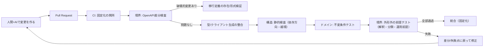

# AI協業開発におけるレール設計（軽量版）

*元ドキュメント: 「AI協業開発におけるレール設計（草案）」の要点を、実装に落とす前提が崩れない範囲で短くまとめたもの。*

---

## TL;DR

AIを「一貫した判断主体」として信頼するのではなく、曖昧さを含む文脈から次の一手を生成する**確率的な生成過程**として扱う。

このときの失敗モードは、AIが変な案を出すことそれ自体ではなく、**不適切な枝が統合され、以降の前提として固定化される**ことである。対策は、**探索（生成）と固定（統合）を分離**し、固定は「検証を通過したものだけ」に従属させることになる。

本書でいう「レール」とは、この固定化の条件を**コードの外側**（＝リポジトリ内の成果物とCI手続き）として定義し、統合可否を機械的に決める装置である。

---

## システム構成例（最小）

「レール」を“物”として扱うなら、少なくとも次の3つがCIで落とされる必要がある。

- 境界：外部契約の違反（契約差分・互換性違反）
- ドメイン：性質の違反（不変条件の破れ）
- アーキテクチャ：構造の違反（依存方向・越境）



ポイントは「順番が正しい」ことではなく、**統合の可否がこれらの判定へ従属する**ようにしておくことだ。人間の注意力・気分・その場の文脈が、固定化可否の一次理由にならない状態を作る。

---

## まず決める二点

レールは、意識的に二つに分解して扱う。

### 1) 探索空間の制約（探索の前提）

AI（生成過程）が「進んでよい方向／進んではいけない方向」を、探索が始まる前に規定する。ここに入るのは、境界の参照点、責務分離、依存方向、生成元（単一参照点）など。

### 2) 固定化の条件（探索結果の選別基準）

生成された変更が統合されてよいかを、探索の後に判定する基準。契約差分、互換性、移行定義の有無、不変条件テスト、構造検査などがこれに当たる。

同じ仕組みが「制約」と「条件」の両方に作用することもある（たとえば依存方向ルールは、事前の設計でもあり、事後の違反検出でもある）。ただ、役割を混同すると議論が散るので、分類はあくまで「今どっちの話をしているか」を整理するための操作だ。

---

## 境界（契約）をどう固定するか

### 一次情報：OpenAPI

境界で固定したいのは外形であり、外形は差分として検出できる必要がある。したがって、OpenAPIをリポジトリ内の**単一参照点**として置き、そこから型やクライアントを生成し、さらに差分比較で互換性違反を検出する、という組でレールを構成する。

ここでの狙いは「互換性を守れ」という気合いではなく、**互換性違反の形を定義して差分で落とす**ことだ。

### 契約更新を3分類する

OpenAPIを一次情報にすると、境界の変更は差分として観測される。この差分を固定化するかどうかは、少なくとも次の3分類に従属させる。

1. **後方互換な変更**  
   例：レスポンスへのフィールド追加、任意パラメータの追加、エラー表現の拡張など。

2. **破壊的変更**  
   例：既存フィールドの削除、型変更、必須化、エンドポイント削除、意味変更など。

3. **外形では検出できない互換性の破れ（解釈・分類・運用前提）**  
   スキーマ差分だけでは十分に把握できない。ここは、境界テストで固定化条件に組み込む。

### 破壊的変更は「移行定義」に従属させる

破壊が差分で観測された瞬間に、その変更を「移行定義の有無」へ従属させる。つまり、移行定義がない破壊は固定化されない。

ここで言う移行とは、「破壊を許す代わりに、利用側が追従できる時間と手順（道筋）を用意する」こと。方式名よりも、少なくとも次が成果物として明示されている必要がある。

- 何が破壊なのか
- 追従のために何を残し、いつまで残すのか
- いつ何をもって移行完了とみなすのか

（YAML等で置く場合、CIが“存在・必須項目・形式”を機械検証できる粒度まで下ろす。）

### 「外形では検出できない互換性」をテストで固定する

OpenAPI差分は外形しか見ないため、解釈・分類・運用前提の変化は取り逃す。したがって、この種の破れは「境界を跨いだ観測」を固定化条件として外部化するしかない。ここが境界テストの位置づけになる。

例（代表ケースをシナリオとして固定する）：

1) **「200の意味が変わる」を固定する**  
「POST /orders が 200 accepted を返したら、注文は確定している」という前提があるなら、それを観測可能な事後条件にする。  
- `POST /orders` で `status=accepted` が返る  
- 直後の `GET /orders/{id}` で `state=confirmed` が観測される（あるいは在庫が減っている等）

2) **「同じ入力の扱いが変わる」を固定する**  
例：`GET /users?email=...` の未登録時が `404` なのか `200 []` なのかは、クライアント分岐の前提なので、その分類を代表ケースで固定する。  
- 未登録 email → `404`  
- 登録済 email → `200` + user

3) **「成功/失敗の分類」を固定する**  
条件ごとに期待するHTTP分類を代表ケースで固定する。  
- 存在しないID → `404`  
- 権限なし → `403`  
- バリデーション不正 → `400`

4) **「値集合の意味が変わる」を固定する**  
可能ならOpenAPI側を `enum` にして外形化する。それが難しいなら、境界テストで「返ってよい値集合」を固定する。  
- 例：`currency` は `JPY/USD` 以外を返さない

5) **「冪等性・副作用」を固定する**  
同じ入力（または同一 `idempotency-key`）を2回投げて観測する。  
- `POST /payments/confirm` を同条件で2回  
- 課金レコードが1件しか増えない／合計金額が変わらない  
- 返却レスポンスが同一（または同一視できる）

---

## ドメイン（不変条件）をどう固定するか

ドメイン側では、テストを「実装の正しさを証明する」ために置くのではなく、**固定してはいけない枝を統合前に落とす**装置として置く。

このときテストが固定するべきなのは“やり方”ではなく“性質”である。禁止された状態遷移、成立してはいけない組み合わせ、権限違反、整合性違反、取り消し不能な破れなどは、探索（生成）の自由度があっても変えてはいけない。

粒度の決め方は、テストの種類（ユニットか統合か）よりも、「固定化条件として必要な性質が表現できているか」を優先する。層を跨ぐ性質は層を跨いでテストしてよい。

---

## アーキテクチャ（構造）をどう固定するか

依存方向や層の越境は、生成過程が局所最適のつもりで踏み抜きやすい。したがって、構造の固定化条件は、レビューより前に機械的に落とせる形にするのが望ましい。

- 依存方向（例：Handler → UseCase → Domain のような片方向）
- 禁止 import（越境）
- モジュール境界の規則

ここでの静的検査は、スタイル統一ではなく「探索空間の制約が破られていない」ことを判定する装置になる。

---

## リポジトリ内の成果物（例）

固定化可否を支配する一次情報は、説明文ではなく、差分として追えて機械的に参照できる成果物に寄せる。

例：

```
contracts/
  openapi.yaml              # 境界の一次情報（単一参照点）
  migrations/
    2026-02-03-...yaml       # 破壊的変更の移行定義（CIが要求する成果物）

backend/                     # 実装（探索の対象）
frontend/                    # 実装（探索の対象）

tests/
  boundary/
    shape/                   # 外形準拠（必要なら）
    assumptions/             # 外形では検出できない前提（解釈・分類・運用）
  domain/
    invariants/              # 不変条件（性質）テスト

tools/
  arch-rules/                # 依存方向・越境のルール定義（静的検査）

.github/workflows/ci.yml     # 固定化の関所（検証順序と要求物）
```

---

## 日々の運用（最小）

- 実装変更（探索）を作る  
- レール（一次情報・固定化条件）が意図どおり参照されている前提で、CIに通す  
- 落ちたなら、落ちた地点の種別に応じて修正する  
  - 契約差分で落ちた：破壊を戻す／移行定義を作る  
  - 構造で落ちた：依存方向・越境を直す  
  - 不変条件/前提で落ちた：性質を満たすよう実装を直す（または、それが設計判断なら固定化条件側を更新する）

この往復の中で重要なのは、固定化可否が「人間の納得感」ではなく、明示された成果物と検証手続きに従属している状態を保つことだ。

---

## どこから手を付けるか（軽量版の結論）

最初に決めるべきことは、次の二つだけ。

1) **境界の一次情報は何にするか**（OpenAPIを置くなら、その更新をどう特別扱いするか）  
2) **固定化の関所（CI）が落とすべき違反は何か**（境界・ドメイン・構造を、どの成果物と検証で閉じるか）

その上で、型生成・差分検査・静的検査・テストの配置は、「上の二点に接続するため」に逆算して導入する。
